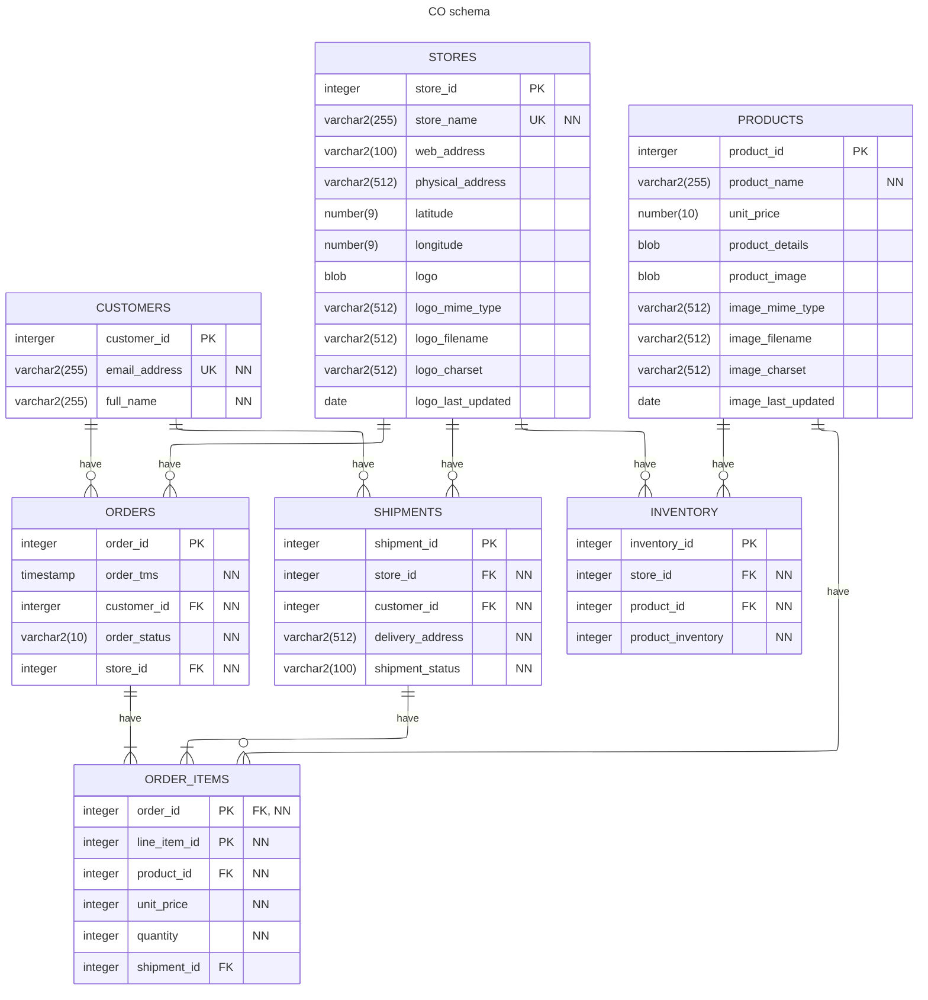

[](https://classroom.github.com/a/OeWihA70)
# Lab6: Customer Gift Package Reward Manager (Nested Tables + Packages + CASE)
In this lab, we aim to work on the Customer-Order database that we installed in lab2. The schema of this database is provided in this assignment. You will need to use this schema in order to complete the lab. 


### Schema Diagram


## Part A — Create Gift Types and GIFT_CATALOG Table (Nested Tables)
(8 marks)
1.	Create a nested table type to store multiple gift items (e.g., 'Teddy Bear', 'Chocolate Box').
2.	Create a table GIFT_CATALOG with the following columns:
     - GIFT_ID (NUMBER)— PRIMARY KEY
     - MIN_PURCHASE (NUMBER) — the minimum purchase amount to qualify for the gift package
     - a nested table of gift items (use the type created above)
3. Configure nested table storage:
```
NESTED TABLE gifts STORE AS <your_storage_table>;
```
4. Insert at least three gift packages, each containing multiple gift items.

**Example rows (You can insert your own values in this table)** 
  	
| GIFT_ID | MIN_PURCHASE | GIFTS (nested table) |
|---------|--------------|-----------------------|
| 1       | 100           | { 'Stickers', 'Pen Set' } |
| 2       | 1000           | { 'Teddy Bear', 'Mug', 'Perfume Sample' } |
| 3       | 10000           | { 'Backpack', 'Thermos Bottle', 'Chocolate Collection' } |

## Part B — Create CUSTOMER_REWARDS Table (Nested Table + Foreign Key)
(3 marks)

Create a table CUSTOMER_REWARDS:
-	REWARD_ID — primary key (identity or sequence)
-	CUSTOMER_EMAIL — customer email from CUSTOMERS
-	GIFT_ID — FOREIGN KEY referencing GIFT_CATALOG(GIFT_ID)
-	REWARD_DATE — defaults to SYSDATE

**This table will be populated by a function that you will implement in this lab**

**Example**

| REWARD_ID | CUSTOMER_EMAIL     | GIFT_ID | REWARD_DATE |
|-----------|--------------------|---------|--------------|
| 101       | alice@example.com  | 2       | 2025-11-12   |
| 102       | bob@example.org    | 1       | 2025-11-12   |
| 103       | charlie@domain.com | 3       | 2025-11-12   |


## Part C — Package CUSTOMER_MANAGER Using the CO Schema

(14 marks)

Create a PL/SQL package named CUSTOMER_MANAGER that assigns gift packages to customers based on the total value of their completed orders.

Your package must work directly with the CO schema shown above. Your package needs to have the following features

1. A public function `GET_TOTAL_PURCHASE(customer_id)`: The function accepts a customer ID and returns the total value of all purchases made by that customer. 
2. A private function `CHOOSE_GIFT_PACKAGE(p_total_purchase)`:
   **Requirements:**
   - Use a CASE expression or CASE logic
   - Select the gift package from GIFT_CATALOG where:
     `MIN_PURCHASE is the largest value <= p_total_purchase`
   - Return the GIFT_ID of the chosen package.
   - If no package applies, return NULL.
3. a public procedure `ASSIGN_GIFTS_TO_ALL`:
   **Requirements**
   For each customer in **CUSTOMERS:**
   1. Compute total purchase (use your function)
   2. Select a suitable gift package (via GIFT_ID returned by your function)
   3. Insert into CUSTOMER_REWARDS:
        -  	customer email
        -  	gift_id
        -  	reward date (current data)

## Part D: Test Package:
(5 marks)

Implement a procedure that joins the `CUSTOMER_REWARDS` and `GIFT_CATALOG` tables and displays the results for the first five customers. Capture a screenshot of the output.

## Submssion
Make a directory named scripts and place all your SQL scripts inside it. Additionally, create another directory named screenshots and include the screenshot for Part D in that folder. Push your submission to the remote repository. Finally, submit the link to your repository in the Moodle assignment.
  


